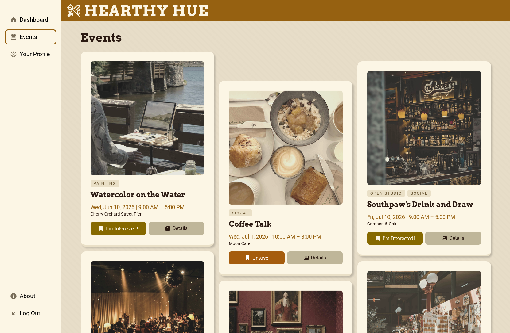

# Hearthy Hue

Hearthy Hue is an app created by me, [Steven Huang](https://github.com/EvenStevenH), that helps creatives discover events! It utilizes frontend technologies such as HTML for structure, CSS for styling, JavaScript for interactivity, and React for component-based UI and state management. Preview a [deployed version here](https://evenstevenh.github.io/hearthy-hue/)!

A few features of this demo include:

- An event page to view and save events, with event details in a separate view

- A dashboard with a mock social media feed, your saved events, and a simple tool to roll random drawing subjects and color harmonies

- A profile page to view information about you and your friends

## Installation

- Fork and clone this repository.

- Move into the project's directory and install dependencies:

    ```Bash
    npm install
    ```

- Run the development server for local viewing:

    ```Bash
    npm run dev
    ```

## Screenshot


